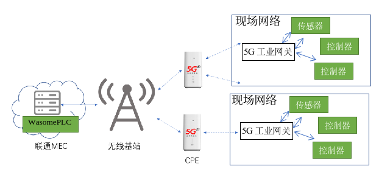
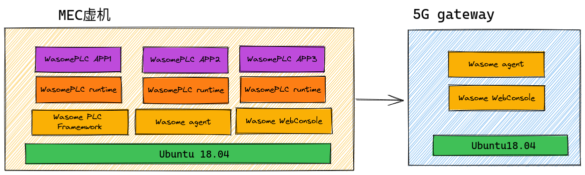
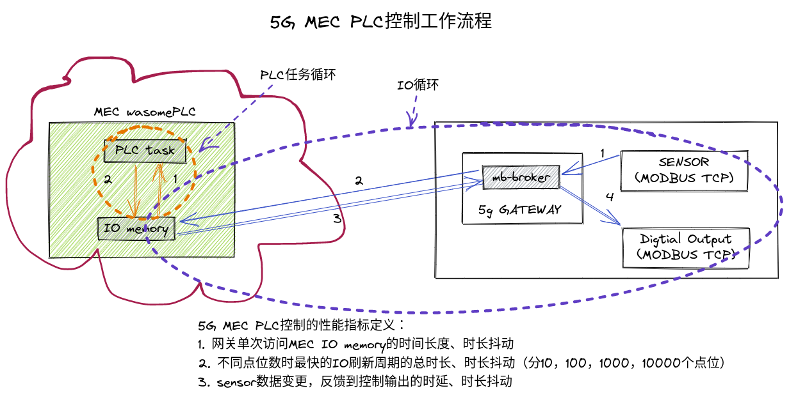
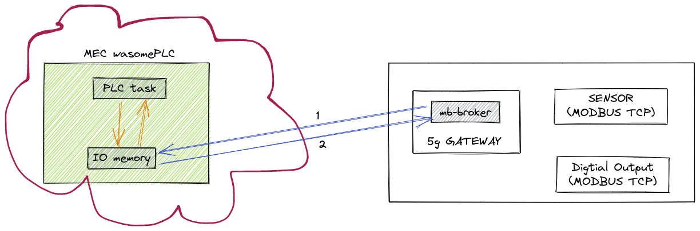
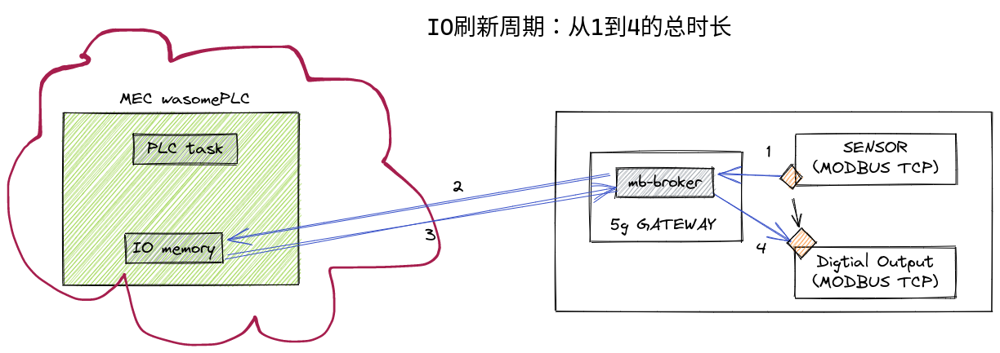
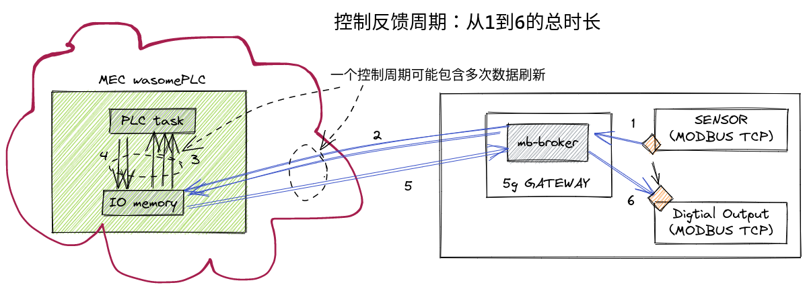
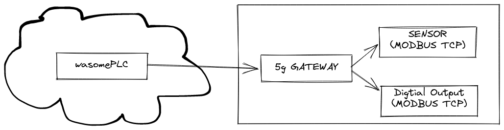

# 5G-MEC-performance
The PLC control app is deployed in the 5G edge cloud and provide automation service through 5G gateway connecting the field sensors and actuators

## 测试组网拓扑图
WasomePLC边缘云平台：领先的工业控制平台，可以支持远程开发、远程部署和远程运维。支持通过5G网络实时控制工厂现场的自动化设备、巡航小车、机器人等。
 
网络连接特点：
部署于MEC侧的WasomePLC边缘云平台: 只有内网IP地址，无公网IP，可以支持VPN远程管理
部署于现场的5G工业网关和WasomePLC边缘云平台保持长连接
现场的各种传感器与控制器不能从MEC侧通过IP网络直接联通，通过工业总线或者局域网与5G工业网关连接。  

## 测试目的
在联通MEC边缘节点上部署WasomePLC边缘云平台，利用5G+MEC边缘计算低时延、大带宽的能力进行端到端的边缘云工业控制场景测试。

## 测试预置环境

### 软件安装：
在MEC虚机中安装以下软件：
- WasomePLC Framework
- Wasome agent 
- Wasome WebConsole
- PLC runtime/PLC APP

在5G网关中安装以下软件：
- Wasome agent 
- Wasome WebConsole  

## 关键测试指标定义
PLC的基本工作流程中包含两种基本的循环任务：
- PLC任务循环：周期性从IO memory中输入区读取输入数据，执行用户定义的控制程序，然后将输出的控制数据写入到IO memory中的输出区。
- IO任务循环：周期性将外部设备上的数据读入到IO memory中输入区，同时将IO memory中的输出区数据通过设备总线写入控制设备。

下图中描述了基于5G的MEC PLC解决方案工作流程图，在5G gateway中运行了一个Modbus broker, 其周期性通过MODBUS总线读取现场各种传感器数据，并通过5G上发到MEC上PLC的IO memory中输入区。同时通过5G读取IO memory中的输出区数据，通过现场总线写入到对应的控制设备。  

基于5G MEC PLC控制的工作流程，我们定义以下核心性能指标并在各个场景中进行采集：
1. 网关单次访问MEC IO memory的时间长度、时长抖动  
  
2. 不同点位数时最快的IO刷新周期的总时长、时长抖动（分10，100，1000，10000个点位不同规模）  
  
3. 端对端控制反馈周期：从sensor数据变更，反馈到控制输出的时延、时长抖动  
  
## 指标的测试方法

### 指标1、2的测试方法
modbus broker提供了内置的测试指标收集功能

### 端对端控制反馈周期测试工具
本项目提供了用于测试指标3的专用测试工具`modbus-test-server`  

参考：[modbus test server](./tools/mb-test-server/README.md)

## 测试场景和结果
### 边缘云PLC远程控制单网关内现场设备
- 测试内容：运行于MEC的WasomePLC APP通过5G网络实时获取传感器数据，运行控制逻辑，通过网关向数值输出设备发送控制指令。 
    
- 测试条件：
- 测试步骤：
- 测试结果：

### 边缘云PLC协同控制多网关内现场设备
- 测试内容：运行于MEC的WasomePLC APP通过5G网络从第一个网关内实时获取传感器数据，运行控制逻辑，通过第二个网关向数字输出设备发送控制指令。演示基于边缘云的控制方案可以有效的跨越多个现场网络实时更大的控制方案。
    
- 测试条件：
- 测试步骤：
- 测试结果：
### 边缘云PLC控制应用并发执行
- 测试内容：MEC的虚机内运行多个WasomePLC APP，各自通过5G网络从其网关内实时获取传感器数据，运行控制逻辑，通过向各自负责的数字输出设备发送控制指令。演示有效利用云资源，实施多个控制应用的并发执行。
    
- 测试条件：
- 测试步骤：
- 测试结果：
### 在边缘云与5G网关之间灵活调度PLC控制应用
- 测试内容：运行于MEC侧的PLC应用，通过系统管理方法，切换到5G网关上运行。演示支持基于5G网络向更边缘侧调度PLC应用。
    
- 测试条件：
- 测试步骤：
- 测试结果：

