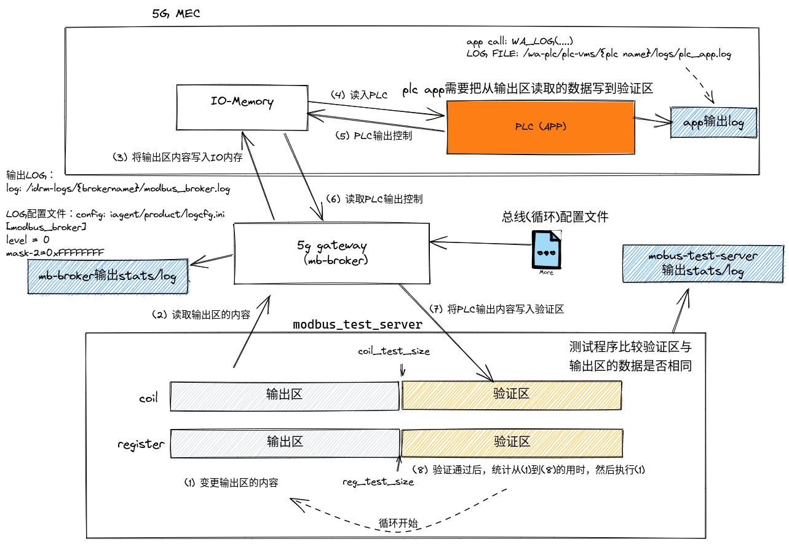

# 基本测试原理

在开始5G环境下端对端测试之前，建议validator.py脚本完成基本验证测试。测试流程如下：


- test-server每一种寄存器使用从0开始的一段区域放可变输出数据（供client读取），另一半放写入数据。

工作机制：
1. testserver自动随机修改输出区的数据内容，记下当前系统时间。
2. 希望PLC APP读取整个输出区的数据，然后使用读到的内容写入到验证区
3. test srever在每次写入后，检查写入验证区的数据内容，如果等于输出区的数据内容，则当作一个控制反馈周期完成。记下当前周期的时间长度，加入统计值。
4. 回到第1步执行，开启一个新的统计周期。

其他：
- 测试数据区长度可以通过命令行参数配置


# 端对端方案




# 使用方法
## 编译测试modbus-test-server

准备安装编译工具链和三方库：
```
sudo apt update
sudo apt install build-essential
sudo apt install cmake

pip install modbus_tk
```

下载代码仓库和依赖的三方代码：
```
git clone https://github.com/wasome-plc/5G-MEC-performance.git
cd 5G-MEC-performance
git submodule init
git submodule update
cd  deps/iagent-sdk/external
./download.sh
```

编译：
```
cd {项目目录}
cd tools/mb-test-server
mkdir build
cd build
cmake ..
make
```

## 启动测试程序
```
Modbus client to measure data bandwith
Usage:
  ./modbus_test_server -c [coil test data size] -r [register test data size] -p [port]
```
如下所示：
```
 ./modbus_test_server -r 16
Unable to load log config /home/wangxin/plc-iot/iagent-core/value-add/projects/modbus-broker/mb-test-server/b/logcfg.ini
print to file, app_name=modbus_test_server
To use the configuration, add a file set.ini under the binary path
Using reg_test_size=16, coil_test_size=8
started TCP mode, now listen on port 1502
connected.
```

## 使用配置文件：
可以在modbus_test_server文件所在的目录创建一个set.ini文件，提供更多的配置参数：
```
coil_test_size= 16
reg_test_size = 8
modbus_debug = 0
port = 1502
stats_duration=100
```

## 使用LOG文件
可以在modbus_test_server文件所在的目录创建一个logcfg.ini文件，定义log的输出级别
```
[modbus_test_server]
level=0
mask=0xFFFF
```

如果正常工作后，会输出非常多的LOG，这时可以可以把level提升到1、2或者3,逐步减少输出数量。

- 控制mask
  - 0x20: 01-16 11:17:59 [V:test] recieved a message. bytes: 12
  - 0x10: 01-16 11:17:59 [V:test] slave: 1, function:3, address=0

以上输出会有很多，如果mask=0xF就可以关闭以上输出。

## 查看统计数据

在modbus_test_server文件所在的目录会有一个mb_test_stats.log包含时长测试数据：
```
tail ./mb_test_stats.log -f
```

缺省配置下没30秒钟会追加一个统计输出：
```
Start time: 00-09 09:51:49
Alarms = 0, Missing counts=0
reporting time: 00-09 09:52:19
[21000 - 22000]: 1
[24000 - 25000]: 28
[25000 - 26000]: 328
[26000 - 27000]: 193
[27000 - 28000]: 67
[28000 - 29000]: 29
[29000 - 30000]: 29
[30000 - 31000]: 15
```

# 验证程序

执行python程序validator.py可以验证modbus_test_server。在执行的过程中，可以tail mb_test_stats.log来查看统计输出。

```
./validator.py -h
usage: validator.py [-h] [-c COIL_SIZE] [-r REG_SIZE]

Modbus test server validator

optional arguments:
  -h, --help    show this help message and exit
  -c COIL_SIZE  The size of coils for test
  -r REG_SIZE   The size of registers for test
  -s            Wait input for each round  
```

例如：
```
./validator.py -s -r 16
recieved data: [
    29555,
    29555,
    29555
]
total: 1, continue?
```